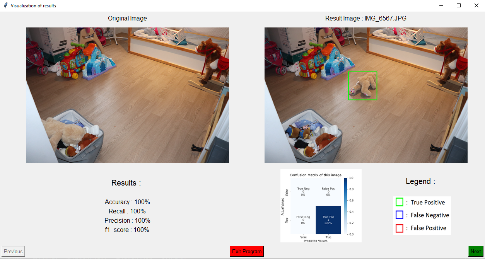

# 8INF804 Traitement Numérique des Images : TP n°1 "Détection d'objets tombés au sol"

## Description
Ce projet a pour objectif la détection d'objets tombés au sol à partir d'une image et de son image de référence. Nous utilisons pour cela les librairies openCV et scikit learn qui nous ont permis dans un premier temps de réaliser la binarisation de l'image à traiter. Des bounding boxes sont ensuite tracées à partir de cette dernière puis un affichage est réalisé sous tkinter. De plus amples explications sur les méthodes employées sont présentes dans le rapport rendu avec le projet.

## Visuel
Voici à quoi ressemble l'interface graphique de notre projet:
- à gauche se trouve l'image de référence et à droite l'image traitée
- les boutons "previous" et "next" permettent de naviguer dans les images du répertoire et d'observer les résultats retournées par l'algorithme
- les principales métriques sont calculées pour chacunes des images et affichées en bas à gauche. Il y a également la matrice de confusion associée et une légende précisant les couleurs des bounding boxes détectées en bas à droite.
- le bouton "Exit Program" permet de quitter l'interface

## Utilisation (sous windows)
- rendez-vous dans le répertoire principal : cd ./tp1_8inf804
- la commande suivante permet d'exécuter le programme : .\venv\Scripts\python ./main.py .\ressources\Chambre\
- il est possible de changer de répertoire en remplaçant Chambre\ par Salon\ ou Cuisine\

## Auteurs
- Ilyes Bennaga (BENI26099904)
- Tom Fercoq (FERT27120007)
- Quentin Callens (CALQ06109900)
- Pierre Lefebvre (LEFP18039809)

   